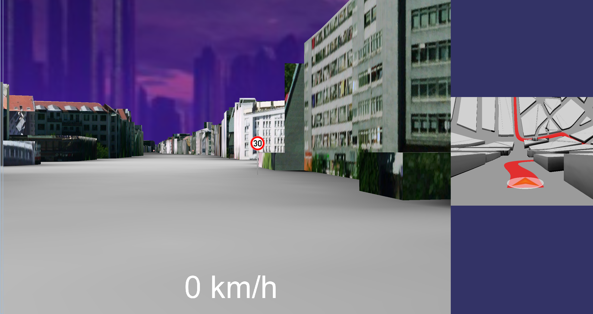

troen-simulator
======
troen-simulator is a driving simulator which is used for evaluating a user study on multiperspective views.
It is based on the game engine of the [Troen game](https://github.com/philippotto/GP2013), which is built on OSG and bullet-physics. 

##Screenshots

##Project Setup

Set up OSG:
- Copy the compiled OpenSceneGraph folder to C:\Program Files\ and create a System Variable "OSG_DIR" with the value: C:\Program Files\OpenSceneGraph
- add %OSG_DIR%\lib; %OSG_DIR%\bin to your PATH variable

Set up FMOD:
- Download fmod and copy to %ProjectDir%\3rdParty\fmod
- add the environment variable FMOD_DIR to this directory
- add %FMOD_DIR%\fmoddesignerapi\api; %FMOD_DIR%\api; to your PATH

Set up BULLET_PHYSICS:
- Download and copy bullet 2.8  to %ProjectDir%\3rdParty\BULLET_PHYSICS, dont use bullet3 as its uncompatible with the game
- no setting of any evironment variable or PATH variable necessary

Set up HIDAPI
- Download and build hidapi https://github.com/signal11/hidapi, copy to
%ProjectDir%\3rdParty\
- add %ProjectDir%\3rdParty\hidapi to your PATH

Set up V8 & Scriptzeug
- Download v8 (bin/include/lib) folder  to 
%ProjectDir%\3rdParty\
- Download and build scriptzeug https://github.com/hpicgs/libzeug, copy to %ProjectDir%\3rdParty\
- create the environment variable %V8_ROOT% and set it to %ProjectDir%\3rdParty\v8
- add the following to your path:
- %V8_ROOT%\bin
- %ProjectDir%\3rdParty\scriptzeug\lib

Set up correct Working Directory:
- in MSVC goto DEBUG->properties->ConfigurationProperties->Debugging and set WorkingDirectory to ".." (without the quotes)
